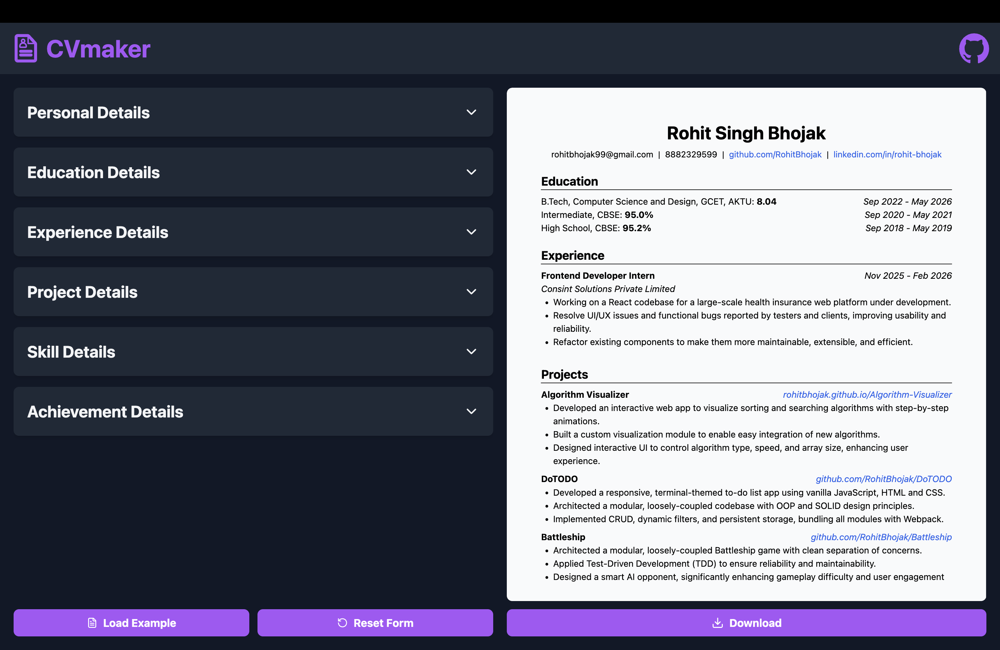

# [CVmaker: ATS-Optimized Resume Builder](https://cv-maker-gray.vercel.app/)

> **Live Link:** [https://cv-maker-gray.vercel.app/](https://cv-maker-gray.vercel.app/)

CVmaker is a high-performance, web-based resume builder designed to help job seekers create professional, ATS-friendly resumes in minutes. Built with a focus on modular architecture and intuitive UX, the application ensures a 100% parse rate for Applicant Tracking Systems while providing a seamless, real-time editing experience.

---

## 🚀 Features

### **Smart Form Management**

- **Step-by-Step Forms**: Organized sections (Personal, Education, Experience, Skills) to prevent user overwhelm.
- **Dynamic Field Entries**: Add or remove as many entries as needed (e.g., multiple degrees or projects) with a single click.
- **Controlled Inputs & Edit Toggle**: Toggle between "Edit" and "Preview" modes for individual form sections before they are committed to the main resume.
- **Form Validation**: Real-time validation powered by custom schemas to ensure no essential data is missed.
- **Reset & Load Example**: Quickly clear the form or populate it with high-quality example data to see the layout in action.

### **Live Preview & Export**

- **Real-Time Synchronization**: The resume preview updates instantly as you submit form sections.
- **ATS-Friendly Template**: Built specifically to pass through 100% of ATS filters with a clean, standard structure.
- **Instant PDF Download**: One-click generation to download a professional PDF file ready for applications.

### **Responsive Design**

- **Dual-View Layout**: A 2-column layout on desktop for side-by-side editing and viewing.
- **Mobile Optimized**: A tab-based navigation on small screens to switch between the form and the preview seamlessly.

---

## 🛠️ Technical Highlights

- **Modular Component Architecture**: Highly decoupled components ensuring easy maintenance and scalability.
- **State Management**: Robust handling of complex, nested objects for dynamic list entries.
- **Tailwind CSS Styling**: Utilizes a utility-first approach for a sleek, "Liquid Glass" type aesthetic with full responsiveness.
- **Vite Tooling**: Blazing fast development and build times.

---

## 🏗️ Built With

